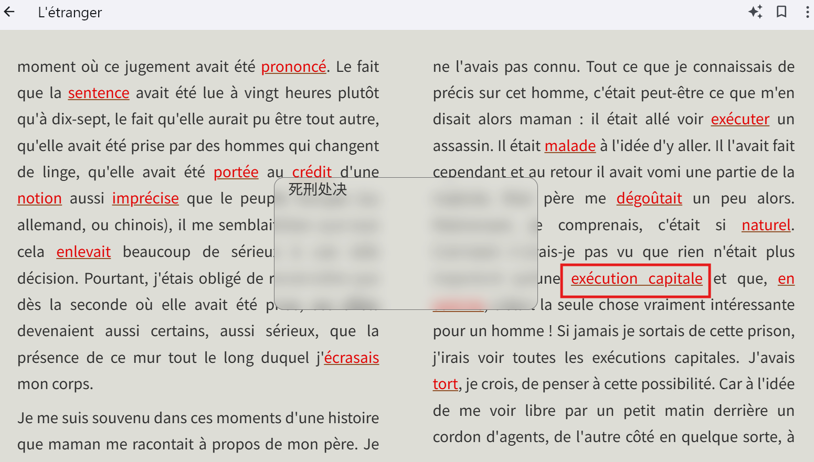

# EPUB Auxiliary Note


## 简介

epub-translator 利用 AI 大模型自动为 EPUB 外文电子书添加弹出式生词注释，方便语言学习。

无论你是开发者、语言学习者，还是电子书爱好者，epub-translator 都能让你轻松跨越语言障碍。

- [x] **多语言互译**：支持 英文、中文、日文、西班牙语、法语、德语等主流语言互译。
- [x] **双语对照**：生成上下对照的双语 EPUB，方便对照学习。
- [x] **插入提示词**：指导 AI 注解，如术语表，角色人名表等。
- [x] **AI 模型可选**：支持 DeepSeek、ChatGPT 等主流大模型。
- [x] **高性能并行**：AI 请求多路并发，快速注解整本书籍。


### 作为库直接调用

你也可以直接写 python 代码，将它作为库调用。此时你需要 python 3.10 或更高版本（推荐 3.10.16）。

```shell
pip install epub-translator
```

## 快速开始

首先，构造出调用 AI 大语言模型 的 `LLM` 对象。

```python
from epub_translator import LLM

llm = LLM(
  key="<LLM-API-KEY>", # LLM 的 API key
  url="https://api.deepseek.com", # LLM 的 base URL
  model="deepseek-chat", # LLM 的模型名
  token_encoding="o200k_base", # 计算 tokens 个数的模型
)
```

然后，就可以调用 `translate` 方法注解了。

```python
from epub_translator import translate, Language

translate(
  llm=llm, # 上一步构造的 llm 对象
  source_path="/path/to/epub/file", # 要注解的原 EPUB 文件
  translated_path="/path/to/translated/epub/file", # 注解后的 EPUB 保存路径
  write_mode=TranslatedWriteMode.REPLACE,
  max_chunk_tokens_count=700,
  gap_rate=0.05,
  target_language=Language.SIMPLIFIED_CHINESE, # 注解目标语言，此例为简体中文。
)
```

调用该方法后，便可在保留 EPUB 格式的前提下，将生词注释以弹出式注释的方式插入原文。



## 功能

### 保存注解进度

调用 `translate` 注解整本 EPUB 电子书需要较长的时间，此过程可能因各种原因中断。如调用 LLM 时因网络原因而报错中断，或用户等不及了手动中断了进程。

EPUB Translator 可以将已注解内容缓存为本地文件，以便在注解同一本书时，实现保存注解进度的功能，可以从上一次注解中断中恢复进度。

只需要在调用 `translate` 配置 `working_path` 字段，指定一个路径缓存注解所产生的文件即可。在下次启动时，EPUB Translator 会事先从该路径尝试读取注解进度。

```python
translate(
  ..., # 其他参数
  working_path="/path/to/cache/translating/files",
)
```

请注意，每次调用 `translate` 方法都会往 `workspace_path` 所在的文件夹写入缓存文件。这会导致这个文件夹越来越大。你需要自行处理，比如，在注解成功后自动清空文件夹。

### 监听注解进度

在调用 `translate` 时通过 `report_progress` 传入一个回调函数，接收一个 0.0 到 1.0 的 `float` 类型的表示进度的参数，便可监听整本书的注解进度。

```python
from tqdm import tqdm
from epub_translator import translate

with tqdm(total=1.0, desc="Translating") as bar:
  def refresh_progress(progress: float) -> None:
    bar.n = progress
    bar.refresh()

  translate(
    ..., # 其他参数
    report_progress=refresh_progress,
  )
```

### 插入提示词

通过插入提示词来指导 AI 大语言模型如何注解。比如，你可以插入术语表，令 AI 在注解时能统一术语。在调用 `translate` 时加上 `user_prompt` 字段即可。

```python
translate(
  ..., # 其他参数
  user_prompt="Le Petit Prince 应该译为“小王子”。",
)
```

### 大语言模型参数

在构建 `LLM` 对象时，还有更多的配置项。

```python
llm = LLM(
  key="<LLM-API-KEY>", # LLM 的 API key
  url="https://api.deepseek.com", # LLM 的 base URL
  model="deepseek-chat", # LLM 的模型名
  token_encoding="o200k_base", # 计算 tokens 个数的本地模型
  timeout=60.0, # 请求超时时间（单位秒）
  top_p=0.6, # 创造力
  temperature=0.85, # 温度
  retry_times=5, # 重试次数，超过此次数后若请求依然失败，则报错
  retry_interval_seconds=6.0, # 重试间隔时间（单位秒）
)
```

## 相关开源库

* [EPUB Translator Original Repo](https://github.com/oomol-lab/epub-translator/) 利用 AI 大模型自动翻译 EPUB 电子书
* [EPUB Rosetta](https://github.com/skywalker1991/epub-rosetta) 提供可以对多种语言的epub电子书进行解析，翻译，标注和语言学习的工具
* [EPUB Wordwise](https://github.com/xiaochun-z/ebook-wordwise) is a tool to add definition to your e-books so you can read books faster and more efficiently

## 相关闭源产品
* Kindle wordwise (only available in Android app or kindle devices for purchased books)